## Welcome to My Page


I have completed my B.Sc. from the Department of EEE, Bangladesh University of Engineering and Technology, in April 2019. Currently, I am working as a Machine Larning Engineer at [REVE Systems](https://www.revesoft.com/), Bangladesh. I am working in REVE Systems for almost a year now. Before joining REVE Systems, I was with the Digital Signal Processing Research Laboratory at the Department of EEE, Bangladesh University of Engineering and Technology.

I have done several projects, competitions and researches related to Machine Learning, Deep Learning, Computer Vision, Intelligent System, Biomedical Image Processing, Audio Processing and Natural Language Processing. The notable projects are mentioned below.

* Forensice Image Generation and Plotting using CNC Plotter
* Wheelchair control using voice command
* Camera Model Identification
* Image caption generation using CNN and LSTM
* ESP8266 based Home Automation with Google Assistant 
* Line Following Bot using Digital Logic Design

### Projects

My Passion for application based Machine Learning, Signal Processing, Image Processing research and development started from my third year of B.Sc. Education. I will explain my projects one by one briefly. I will also give link to the codes for some projects.


#### Forensic Image Generation and Plotting Using CNC Plotter

In my fourth year, in Control Systems I Laboratory, I did a group project for generating images of crime suspects from facial attributes and plotting using CNC plotter. The idea was to do the job of a sketch artist in a forensic department. We used generative model to generate image from facial attributes and after processing the image the image was to be plotted in a 2D paper using CNC plotter. We designed and trained the generative model using [Celeb-A dataset](http://mmlab.ie.cuhk.edu.hk/projects/CelebA.html) and built the CNC Plotter ourself with a limited budget.

Celeb-A dataset has over 200k+ dataset of celebrities with their facial attributes. There were a total of fourty facial attributes. We converted these facial attributes into a 40-dimensional binary vector. We designed an encoder to transform this encoded vector into a latent representation. We also designed a ResNet based Generator Network to transform this latent representation into an image. The generative model was trained using Celeb-A dataset. Our network was trained using a MSE-Loss coupled with Adversarial-Loss. Some sample output of validation set is given below.

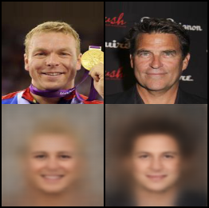 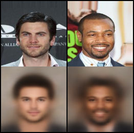

The top row is the reference images and the bottom row is the generated images with the facial attributes of refernce images given as input. The generated images are not the sharpest and clearest images in quality, but was sufficient to impress our teacher and peers. These are the generated images for the validation set images, and you must be wondering what is the performance with random facial attributes given as input. The code for this project can be found in this [link](https://github.com/sabbiracoustic1006/forensic-image-generation). Lets run the code with a random but carefully chosen input facial attributes. 


```markdown
# The attributes list is given below
attribute_list = ['5_o_Clock_Shadow', 'Arched_Eyebrows', 'Attractive',' Bags_Under_Eyes', 'Bald', 'Bangs', 
                  'Big_Lips', 'Big_Nose', 'Black_Hair', 'Blond_Hair', 'Blurry', 'Brown_Hair', 'Bushy_Eyebrows',
                  'Chubby', 'Double_Chin', 'Eyeglasses', 'Goatee', 'Gray_Hair', 'Heavy_Makeup', 'High_Cheekbones',
                  'Male', 'Mouth_Slightly_Open', 'Mustache', 'Narrow_Eyes', 'No_Beard', 'Oval_Face', 'Pale_Skin',
                  'Pointy_Nose', 'Receding_Hairline', 'Rosy_Cheeks', 'Sideburns', 'Smiling', 'Straight_Hair',
                  'Wavy_Hair', 'Wearing_Earrings', 'Wearing_Hat', 'Wearing_Lipstick', 'Wearing_Necklace', 
                  'Wearing_Necktie', 'Young']


# Step for generating an image for an attractive Female with brown hair and heavy makeup
python inference.py --attributes 'brown_hair heavy_makeup attractive no_beard' \
                    --encoder saved_models/vae.pth --generator saved_models/generator.pth \
                    --device cpu 
                    
# it is a bit non sense that no_beard has to be given as input for generating image of a female,
# the attributes processing has to be improved :)
# A generated image will be saved in generated-imgs folder with the same name as the attributes
```
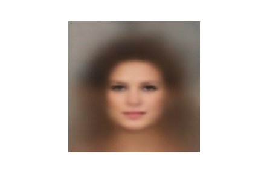   

Now let's see what happens when we add young attribute. The code is given below.

```markdown
python inference.py --attributes 'brown_hair heavy_makeup attractive no_beard young' \
                    --encoder saved_models/vae.pth --generator saved_models/generator.pth \
                    --device cpu 
                    
# A younger female's image is generated hopefully
```
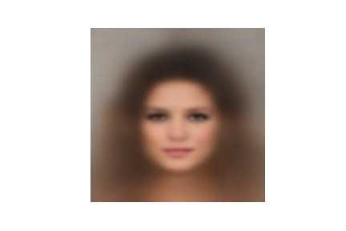

Now let's see what happens if we add eyeglasses attribute. The code is given below.

```markdown
python inference.py --attributes 'brown_hair heavy_makeup attractive no_beard young eyeglasses' \
                    --encoder saved_models/vae.pth --generator saved_models/generator.pth \
                    --device cpu 
                    
```
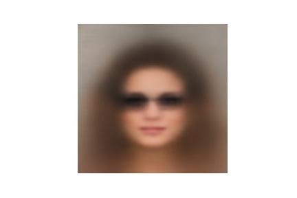
 
Indeed she is wearing glasses now. Now let's see how does she looks while smiling. The code is given below.

```markdown
python inference.py --attributes 'brown_hair heavy_makeup attractive no_beard young eyeglasses smiling' \
                    --encoder saved_models/vae.pth --generator saved_models/generator.pth \
                    --device cpu 
                    
```
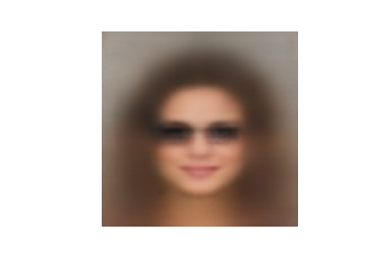

Finally the smile :) ... The model shows generalized performance.

Now that we could generate face images from facial attributes, we had to find a way to plot the image in a 2D paper. The generated image is a colored image. However, we could not plot a colored image. For plotting purpose, we could convert the RGB image to Gray Image. The plotting problem would still persist with Gray Image. We would have to plot 256 intensities in a 2D paper, which was not feasible for us. Therefore, we adopted dithering algorithm. This enabled us to retain details of the image while giving us the ease to plot using a binary decision, i.e., whether to plot a point or not. The image for the smiling woman can be dithered using following piece of code.

```
# dither an existing image
python preprocess.py --path generated-imgs/brown_hair_heavy_makeup_attractive_no_beard_young_eyeglasses_smiling.jpg
```

When the above generated image of the smiling young woman with glasses is given as input for dithering the output is as follows.

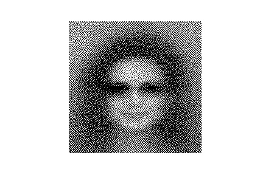

The image is converted by dithering algorithm. Now the processed image has only two possible pixel intensities, i.e., zero and one. The image can now be plotted using a CNC plotter.

Now that the software part was almost complete, we had to find a way to make the plotter and design the whole system ourself in a very limited budget. We gathered the money ourself and 10K BDT was all we could manage for the project from our team members. First of all, we wanted to take facial attributes as input. For that reason, we used a LCD display and a switch systom for taking facial attributes as input. An image for this portion is given below.

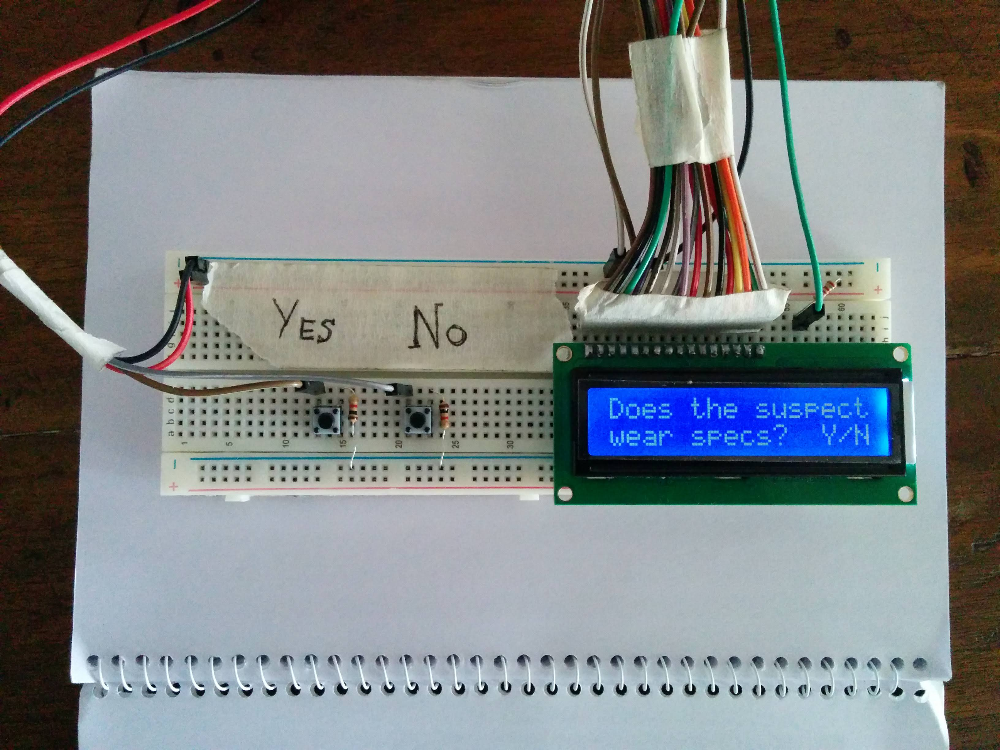
 
Although we worked hard and spent several weeks for designing the CNC plotter, it lacked precision in its ability to draw a given image. The pixels of the image were mapped to coordinates in a 2D paper. We used two nema stepper motors to control the x and y axis. And we used a servo motor to control the up and down movement of a pen to put a dot in the desired coordinate. Below, a video of our CNC plotter drawing a rectangle is attached. Click on the image to see the video.

[](https://www.youtube.com/watch?v=dK8GlewlfwY)

#### Wheelchair control using voice command

This is an impactful project for people with paralysis or physical impairment. The motivation for doing this project was to improve the life of such people. With limited resource and budget, we used car as a prototype as a replacement of wheelchair. The car was controlled via a motordriver circuit. We used L298N motordriver circuit. This motordriver circuit has four digital write pins where signals can be sent to control the car via this circuit. The motordriver IC is shown in the image below.


In this project, we used voice command to control the movement of the car by processing the voice commands in MATLAB and maintaining MATLAB-ARDUINO communication
via Bluetooth module. The flow chart of the working procedure is shown below.

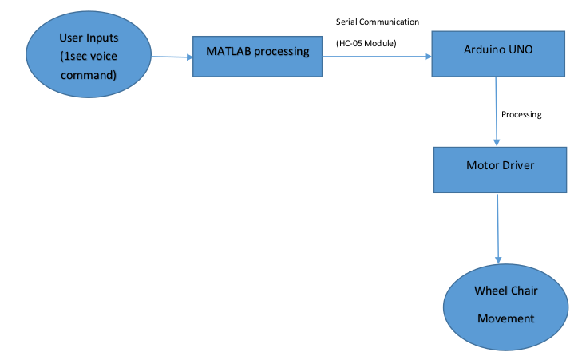

* We have used four voice commands(FORWARD,RIGHT,LEFT,STOP) to control the wheel chair
* First, the voice commands are saved as .MAT file in MATLAB from a specific user to use as reference
* Then voice commands from user are taken and processed by matlab to produce corresponding command codes
* For serial communication, we used HC-05 Bluetooth Module which is paired with matlab using the Bluetooth of PC
* Corresponding Command codes are sent to ARDUINO through the Bluetooth module
* Then arduino processed the received code to generate the required logic for the motor driver to control the car according to user’s intended direction

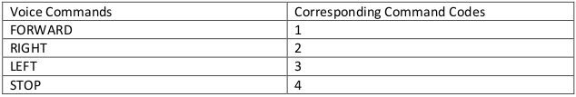

Below the matlab code for prerecording MFCCs for audio commands is shown.
```markdown
clc; clear all;
Fs = 44100; nBits = 8; nChannels = 1;
Tw = 20;
# analysis frame duration (ms)
Ts = 10;
# analysis frame shift (ms)
alpha = 0.97;
# preemphasis coefficient
R = [ 300 3700 ]; % frequency range to consider
M = 20;
# number of filterbank channels
C = 13;
# number of cepstral coefficients
L = 22;
# cepstral sine lifter parameter
# hamming window 
hamming = @(N)(0.54-0.46*cos(2*pi*[0:N-1].'/(N-1)));

A = [];
for f = 1 : 4
n = input( 'For how many sec you want to record?' );
recObj = audiorecorder(Fs,nBits,nChannels);
disp( 'Start speaking.' );
recordblocking( recObj,n );
disp( 'End of Recording.' );
play(recObj);
y = getaudiodata(recObj);
[ b, FBEs, frames ] = mfcc( y, Fs, Tw, Ts, alpha, hamming, R, M, C, L );
A(:,:,f) = b;
end
```

The user given command at test time was aligned and the closest match was found using euclidean distance. The code snippet for this alignment and finding closest match is given below.

```markdown
# Connection of Bluetooth module
a = Bluetooth('HC-05',1);
fopen(a);
'Bluetooth Successfully Connected'

# record audio for 1 second
recObj = audiorecorder(Fs,nBits,nChannels);
disp( 'Start speaking.' );
recordblocking( recObj,1 );
disp( 'End of Recording.' );
play(recObj);
y = getaudiodata(recObj);
[ b, FBEs, frames ] = mfcc( y, Fs, Tw, Ts, alpha, hamming, R, M, C, L );

# the mfccs for the test command is aligned and matched with the prerecorded audio commands mfccs
error = zeros(4,length(b));
for k = 1:4
for j = 1:length(b)
error(k,j) = dtw(A(:,:,k),circshift(b,j-1,2));end
end
err = min(error,[],2);
result = find(err == min(err))
fprintf(a,result);
```

A video of our voice controlled vehicle is shared below.

[](https://www.youtube.com/watch?v=zR8EKmbXl-U)

#### Camera Model Identification
Camera model identification is a fascination research topic. Information about source camera can be traced via processing the image captured by the camera. To understand the traces left by the camera in the image, the internal processing pipelie of the camera needs to be observed. A flow chart for camera's internal processing pipeline is given below.

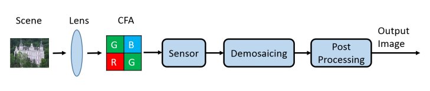

When a digital camera captures an image, light reflected from a real-world scene passes through the camera’s lens and optical filter before hitting the imaging sensor. Since most cameras are equipped with only one sensor, they cannot simultaneously record all three primary colors of light at each pixel location. To solve this dilemma, most commercial cameras place a color filter array (CFA) immediately before the sensor. The CFA allows only one color component of light to pass through it at each position before reaching the sensor. As a result, the sensor records only one color value at each pixel location. Next, the two unobserved color values at each pixel location must be interpolated using a process known as demosaicing. There are generally two types of demosaicing algorithms: non-adaptive and adaptive. Non-adaptive demosaicing algorithms apply a uniform strategy to interpolate unobserved colors throughout the whole image. After demosaicing, the image often undergoes a set of post-processing operations such as white balancing, gamma correction, and JPEG compression.

Among all CFA patterns, the Bayer pattern is the most commonly used. Bayer pattern sampling is shown in the figure below.

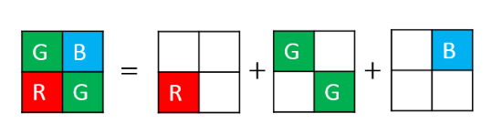

Most of modern cameras, employ adaptive demosaicing algorithms which can provide higher picture quality. In order to prevent blurring artifacts in textured regions, adaptive algorithms interpolate missing colors in a manner that varies according to the image content. They may also adopt different strategies in different color channels, or interpolate one color channel using the pixel values of other channels. This will introduce complex intra-channel and inter-channel dependencies, making the demosaicing algorithm very nonlinear. 

Therefore, a signature of the camera model can be expected to find if the image is sampled according to bayer pattern and simple non-adaptive demosaicing algorithms are used. Specifically, an error matrix of the original image and the simple demosaiced image is much more likely to contain the trace of camera model information.

The image can be read and sampled according to bayer pattern using the matlab code given below.

```markdown
# Reading image and sampling according to bayer pattern
I = imread(fullname)
S = BayerFilter(I,[2 3;1 2]);

# [2 3;1 2] matrix correspond to the pattern [Green Blue;Red Green]

# matlab function for bayer sampling
function A = BayerFilter(I, d)

[m,n,~]=size(I);
    
A=zeros(m,n);
    
A(1:2:end,1:2:end)=I(1:2:end,1:2:end,d(1));
A(2:2:end,1:2:end)=I(2:2:end,1:2:end,d(2));
A(1:2:end,2:2:end)=I(1:2:end,2:2:end,d(3));
A(2:2:end,2:2:end)=I(2:2:end,2:2:end,d(4));

end
```

The error matrix can be calculated with the following code. The error matrix is found simply by subtracting the nearest neighbor demosaiced image from the original image after bayer sampling.

```markdown
# demosaicing and error calculation
Id = demosaicing_v2(S,'neighbor');
E = double(I) - Id;
```

#### Image caption generation using CNN and LSTM
Image caption generation is a fascinating project. Training a deep learning model to generate caption of the image is a cumbersome process. I used CNN as encoder and LSTM as decoder to generate a sentence that corresponds to the image. The problem is similar to seq2seq modelling. However, the encoder is not a RNN, rather it is a CNN which creates feature representation from which decoder learns to predict a sentence caption by decoding one word/token at a time. I used pretrained Resnet18 as the encoder CNN that creates a feature representation of the image which is then transformed to initial hidden state and cell state for the decoder. The code for the project can be found at this [link](https://github.com/sabbiracoustic1006/image-caption-generation). Some sample caption predictions of the model is shown below.

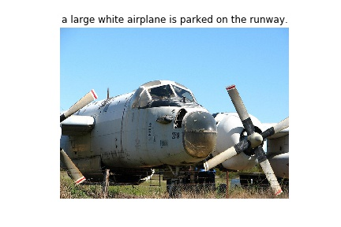 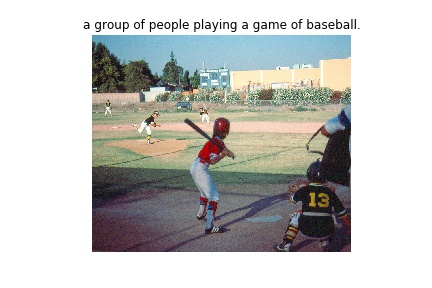
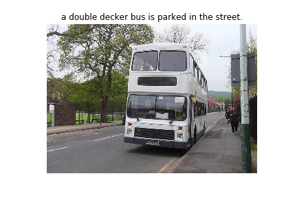 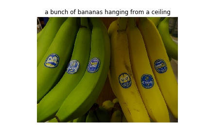
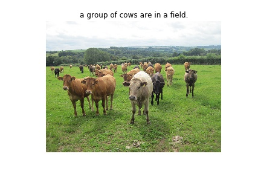 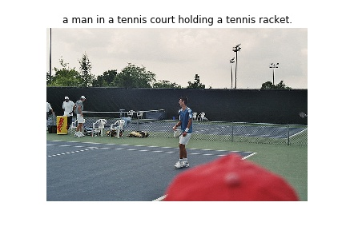
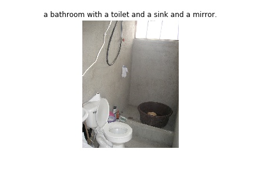 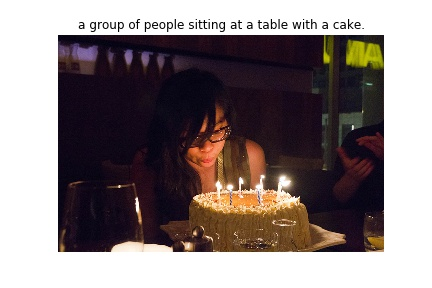


The model can be trained with the command that is given below.
```markdown
# train the model from command line using the command
python train.py --key caption_model --epochs 40 --batch_size 64 \
                --device cuda --padding_idx 10000
```

The model can be used to make predictions on the validation dataset using the command given below. Running this code will create a folder named predicted-captions and the images with predicted captions as their title will be saved in the folder.
```markdown
# run the command in the commandline
python inference.py
```
#### ESP8266 based Home Automation with Google Assistant 

This was a fun project that I did at my home. Used Optocoupler and Triac with NodeMCU to control home light and fan. IFTTT
was used to establish network connection between Google Assistant and Blynk app. Then Blynk app was used to send signals through wifi to the NodeMCU which in turn controlled switching of the light and fans.

The schematic diagram of the circuit is shared below.

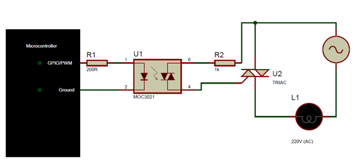

The real circuit looks a bit messy. A picture is shared below.

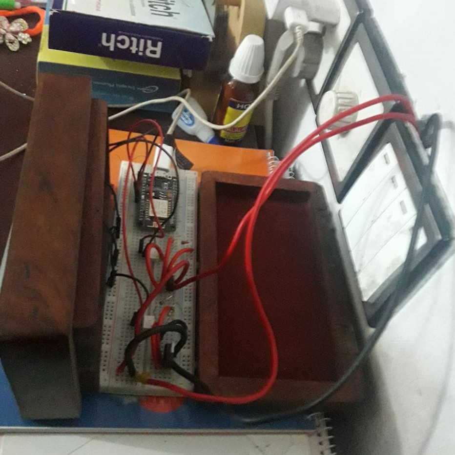

#### Line Following Bot using Digital Logic Design

For our Digital Logic Design Lab, we designed and implemented a robot capable of line following using Digital Logic Design (DLD) techniques. This task is straightforward if microcontroller is used. However, it becomes a lot more complicated if the logic is designed using basic logic gates and flip flop. We used IR sensors to get information regarding positional changes during the robots movement and the motion is controlled using a motor driver circuit that is controlled using a DLD circuit.

The schematic diagram of the circuit is shared below.

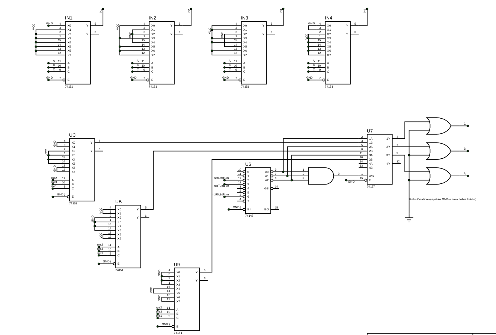
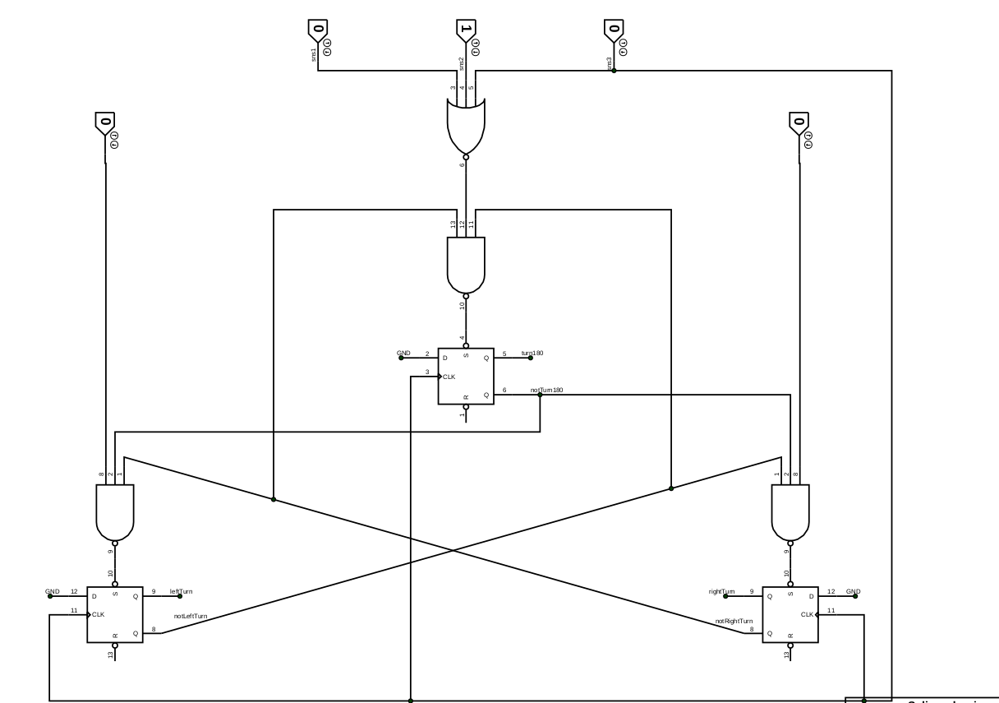
